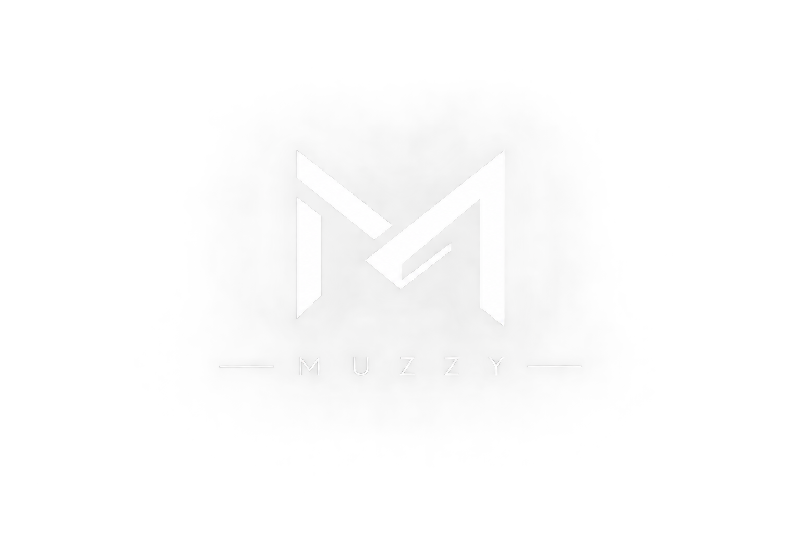

<div align="center">
  
  <h1>Muzammil C — Portfolio</h1>
  <p>
    <strong>A high-performance, meticulously designed personal portfolio built with Next.js and TypeScript.</strong>
  </p>
  <p>
    <a href="https://not-muzzyy.github.io/">View Live Site</a> •
    <a href="#tech-stack">Tech Stack</a> •
    <a href="#design-philosophy">Design Philosophy</a> •
    <a href="#features">Features</a>
  </p>
</div>

---

## ✦ Overview

Welcome to my personal portfolio repository! This codebase powers my professional online presence, showcasing my work in **Cybersecurity**, **Machine Learning**, and **Software Engineering**.

Rather than relying on bloated component libraries, this portfolio is built from the ground up to be blazingly fast, heavily optimized for all devices, and strictly adheres to modern, premium design aesthetics.

## 🚀 Tech Stack

- **Framework:** [Next.js](https://nextjs.org) (App Router)
- **Language:** [TypeScript](https://www.typescriptlang.org/)
- **Styling:** Custom Vanilla CSS with strict variable-based theming
- **Deployment:** GitHub Pages (via GitHub Actions CI/CD)
- **Icons:** FontAwesome

## 🎨 Design Philosophy

This portfolio was constructed following strict design guidelines to ensure a premium user experience:

- **UI-UX Pro Max:** Adheres to modern interaction patterns including fluid hover states, magnetic cursor tracking, and precise 44x44pt touch targets for mobile accessibility.
- **Hallmark Methodology:** Avoids "AI slop" or generic templates. Every component is intentionally crafted.
- **Color Theory:** Built on a sleek, dark-mode-first aesthetic (`hsla` colors) with a subtle purple-indigo accent (`var(--accent)`), creating a tech-forward yet highly professional look.
- **Glassmorphism:** Strategic use of `backdrop-filter: blur(24px)` to create depth and visual hierarchy without clutter.

## ✨ Key Features

- **Fluid Mobile Navigation:** A custom-built, glassmorphic hamburger menu that smoothly slides down and blurs the background content on mobile devices.
- **Native Snap-Scroll Carousels:** The Projects and Certifications sections utilize 100% native CSS `scroll-snap` features on mobile devices, ensuring perfectly smooth 60fps horizontal swiping with zero JavaScript overhead.
- **Staggered Scroll Reveals:** Elements elegantly fade and slide into view as the user scrolls down the page, triggered by an optimized `IntersectionObserver`.
- **Dynamic Mouse Glow:** Interactive elements feature a subtle radial gradient glow that precisely tracks the user's mouse cursor across the screen.
- **Overflow Protection:** Strict CSS clamping and truncation (`text-overflow: ellipsis`) guarantees the layout never breaks, even on the narrowest of mobile screens.

## 🛠️ Getting Started

To run this portfolio locally on your machine:

1. **Clone the repository:**
   ```bash
   git clone https://github.com/not-muzzyy/not-muzzyy.github.io.git
   cd not-muzzyy.github.io
   ```

2. **Install dependencies:**
   ```bash
   npm install
   ```

3. **Start the development server:**
   ```bash
   npm run dev
   ```

4. Open [http://localhost:3000](http://localhost:3000) in your browser to view the site.

## 📄 Documentation

For a deeper dive into how this site was designed and built, check out the documentation files included in the repository:
- `design.md`: The overarching design blueprint.
- `color.md`: The strict color palette and `hsla` tokens used.
- `mobile.md`: A breakdown of the mobile optimization techniques applied to the layout.

---
<div align="center">
  <i>Built with precision by Muzammil C.</i>
</div>
